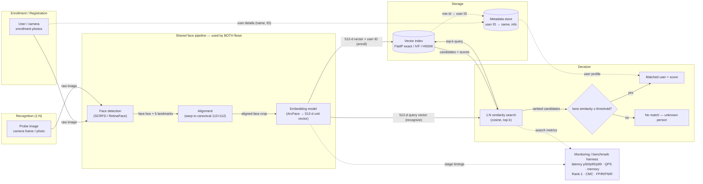

# System Architecture — 1:N Face Recognition

## Mermaid diagram



**Legend** — solid arrows: data on the hot path (enrollment or recognition);
dotted arrows: metadata and telemetry; cylinders: persistent stores; diamond:
decision point; the center subgraph is executed by *both* flows — enrollment and
recognition differ only in what happens to the embedding afterward.

**Caption.** Both flows enter through the same three-stage face pipeline: a
detector finds the face and its five landmarks, alignment warps it onto the
canonical 112×112 geometry the embedding model was trained on, and the ArcFace
model converts it into a 512-dimension L2-normalized vector. During
**enrollment**, that vector is stored in the vector index (exact FlatIP, or
approximate IVF/HNSW) keyed to the user's row in the metadata store. During
**recognition**, the vector instead becomes a query: the index returns the
top-k most-similar enrolled vectors by cosine similarity, and a threshold on
the best score decides between "matched user" (resolved to a profile via the
metadata store) and "no match / unknown" — the open-set case. A monitoring
harness taps both the pipeline and the search path, tracking latency
percentiles, throughput, memory, and identification accuracy as the gallery
grows.

## SVG version

Standalone file: [architecture.svg](architecture.svg) (same diagram, clean static SVG).

```svg
<svg xmlns="http://www.w3.org/2000/svg" viewBox="0 0 1400 675" font-family="system-ui, 'Segoe UI', sans-serif">
  <defs>
    <marker id="aG" viewBox="0 0 10 10" refX="9" refY="5" markerWidth="7" markerHeight="7" orient="auto-start-reverse"><path d="M0,0L10,5L0,10z" fill="#008300"/></marker>
    <marker id="aP" viewBox="0 0 10 10" refX="9" refY="5" markerWidth="7" markerHeight="7" orient="auto-start-reverse"><path d="M0,0L10,5L0,10z" fill="#d55181"/></marker>
    <marker id="aB" viewBox="0 0 10 10" refX="9" refY="5" markerWidth="7" markerHeight="7" orient="auto-start-reverse"><path d="M0,0L10,5L0,10z" fill="#2a78d6"/></marker>
    <marker id="aK" viewBox="0 0 10 10" refX="9" refY="5" markerWidth="7" markerHeight="7" orient="auto-start-reverse"><path d="M0,0L10,5L0,10z" fill="#898781"/></marker>
  </defs>
  <rect width="1400" height="675" fill="#fcfcfb"/>
  <text x="30" y="32" font-size="16" font-weight="700" fill="#0b0b0b">1:N Face Recognition — System Architecture</text>

  <!-- dotted: enrollment user details -> metadata -->
  <path d="M117,150 L117,48 L900,48" fill="none" stroke="#898781" stroke-width="1.5" stroke-dasharray="4 4" marker-end="url(#aK)"/>
  <text x="430" y="40" font-size="10.5" fill="#52514e">user details (name, ID)</text>

  <!-- inputs -->
  <rect x="30" y="150" width="175" height="60" rx="8" fill="#f2f8f2" stroke="#008300" stroke-width="1.5"/>
  <text x="117" y="175" font-size="12.5" font-weight="600" fill="#0b0b0b" text-anchor="middle">User / camera</text>
  <text x="117" y="192" font-size="10.5" fill="#52514e" text-anchor="middle">enrollment photos</text>

  <rect x="30" y="440" width="175" height="60" rx="8" fill="#fdf1f5" stroke="#d55181" stroke-width="1.5"/>
  <text x="117" y="465" font-size="12.5" font-weight="600" fill="#0b0b0b" text-anchor="middle">Probe image</text>
  <text x="117" y="482" font-size="10.5" fill="#52514e" text-anchor="middle">camera frame / photo</text>

  <!-- input arrows -->
  <path d="M205,180 L260,180 L260,292 L320,292" fill="none" stroke="#008300" stroke-width="2" marker-end="url(#aG)"/>
  <text x="254" y="240" font-size="10.5" fill="#52514e" text-anchor="end">raw image</text>
  <path d="M205,470 L260,470 L260,322 L320,322" fill="none" stroke="#d55181" stroke-width="2" marker-end="url(#aP)"/>
  <text x="254" y="404" font-size="10.5" fill="#52514e" text-anchor="end">raw image</text>

  <!-- shared pipeline group -->
  <rect x="300" y="240" width="535" height="140" rx="10" fill="none" stroke="#2a78d6" stroke-width="1.5" stroke-dasharray="6 4"/>
  <text x="310" y="260" font-size="11" font-weight="700" fill="#2a78d6">SHARED FACE PIPELINE (both flows)</text>

  <rect x="320" y="278" width="140" height="58" rx="8" fill="#eef4fc" stroke="#2a78d6" stroke-width="1.5"/>
  <text x="390" y="302" font-size="12.5" font-weight="600" fill="#0b0b0b" text-anchor="middle">Face detection</text>
  <text x="390" y="318" font-size="10.5" fill="#52514e" text-anchor="middle">(SCRFD)</text>

  <rect x="505" y="278" width="140" height="58" rx="8" fill="#eef4fc" stroke="#2a78d6" stroke-width="1.5"/>
  <text x="575" y="302" font-size="12.5" font-weight="600" fill="#0b0b0b" text-anchor="middle">Alignment</text>
  <text x="575" y="318" font-size="10.5" fill="#52514e" text-anchor="middle">(warp to 112×112)</text>

  <rect x="690" y="278" width="125" height="58" rx="8" fill="#eef4fc" stroke="#2a78d6" stroke-width="1.5"/>
  <text x="752" y="302" font-size="12.5" font-weight="600" fill="#0b0b0b" text-anchor="middle">Embedding</text>
  <text x="752" y="318" font-size="10.5" fill="#52514e" text-anchor="middle">(ArcFace, 512-d)</text>

  <path d="M460,307 L505,307" fill="none" stroke="#2a78d6" stroke-width="2" marker-end="url(#aB)"/>
  <text x="482" y="360" font-size="10.5" fill="#52514e" text-anchor="middle">box + 5 landmarks</text>
  <path d="M645,307 L690,307" fill="none" stroke="#2a78d6" stroke-width="2" marker-end="url(#aB)"/>
  <text x="667" y="360" font-size="10.5" fill="#52514e" text-anchor="middle">aligned face</text>

  <!-- metadata store -->
  <rect x="900" y="20" width="210" height="64" rx="8" fill="#ffffff" stroke="#52514e" stroke-width="1.5"/>
  <text x="1005" y="46" font-size="12.5" font-weight="600" fill="#0b0b0b" text-anchor="middle">Metadata store</text>
  <text x="1005" y="63" font-size="10.5" fill="#52514e" text-anchor="middle">user ID &#8594; name, info</text>

  <!-- vector index (cylinder) -->
  <path d="M900,138 v48 a105,12 0 0 0 210,0 v-48" fill="#eef4fc" stroke="#2a78d6" stroke-width="1.5"/>
  <ellipse cx="1005" cy="138" rx="105" ry="12" fill="#eef4fc" stroke="#2a78d6" stroke-width="1.5"/>
  <text x="1005" y="166" font-size="12.5" font-weight="600" fill="#0b0b0b" text-anchor="middle">Vector index</text>
  <text x="1005" y="183" font-size="10.5" fill="#52514e" text-anchor="middle">FlatIP exact &#183; IVF &#183; HNSW</text>

  <path d="M1005,126 L1005,84" fill="none" stroke="#898781" stroke-width="1.5" stroke-dasharray="4 4" marker-end="url(#aK)"/>
  <text x="1013" y="108" font-size="10.5" fill="#52514e">row id &#8594; user ID</text>

  <!-- enroll edge -->
  <path d="M815,295 L860,295 L860,166 L900,166" fill="none" stroke="#008300" stroke-width="2" marker-end="url(#aG)"/>
  <text x="855" y="226" font-size="10.5" fill="#52514e">512-d vector + user ID</text>

  <!-- search -->
  <rect x="900" y="430" width="180" height="64" rx="8" fill="#fdf1f5" stroke="#d55181" stroke-width="1.5"/>
  <text x="990" y="456" font-size="12.5" font-weight="600" fill="#0b0b0b" text-anchor="middle">1:N similarity search</text>
  <text x="990" y="473" font-size="10.5" fill="#52514e" text-anchor="middle">cosine, top-k</text>

  <path d="M815,325 L860,325 L860,462 L900,462" fill="none" stroke="#d55181" stroke-width="2" marker-end="url(#aP)"/>
  <text x="850" y="404" font-size="10.5" fill="#52514e">512-d query vector</text>

  <path d="M985,430 L985,200" fill="none" stroke="#d55181" stroke-width="2" marker-end="url(#aP)"/>
  <text x="977" y="322" font-size="10.5" fill="#52514e" text-anchor="end">top-k query</text>
  <path d="M1035,200 L1035,430" fill="none" stroke="#2a78d6" stroke-width="2" marker-end="url(#aB)"/>
  <text x="1043" y="322" font-size="10.5" fill="#52514e">top-k + scores</text>

  <!-- decision -->
  <polygon points="1190,427 1260,462 1190,497 1120,462" fill="#ffffff" stroke="#0b0b0b" stroke-width="1.5"/>
  <text x="1190" y="458" font-size="11" font-weight="600" fill="#0b0b0b" text-anchor="middle">best sim</text>
  <text x="1190" y="472" font-size="11" font-weight="600" fill="#0b0b0b" text-anchor="middle">&#8805; &#964; ?</text>
  <path d="M1080,462 L1120,462" fill="none" stroke="#d55181" stroke-width="2" marker-end="url(#aP)"/>
  <text x="1100" y="518" font-size="10.5" fill="#52514e" text-anchor="middle">ranked candidates</text>

  <rect x="1130" y="300" width="190" height="58" rx="8" fill="#f2f8f2" stroke="#008300" stroke-width="1.5"/>
  <text x="1225" y="324" font-size="12.5" font-weight="600" fill="#0b0b0b" text-anchor="middle">Matched user + score</text>
  <text x="1225" y="341" font-size="10.5" fill="#52514e" text-anchor="middle">identity resolved</text>
  <path d="M1190,427 L1190,358" fill="none" stroke="#008300" stroke-width="2" marker-end="url(#aG)"/>
  <text x="1198" y="398" font-size="10.5" fill="#52514e">yes</text>

  <rect x="1130" y="560" width="190" height="58" rx="8" fill="#ffffff" stroke="#898781" stroke-width="1.5"/>
  <text x="1225" y="584" font-size="12.5" font-weight="600" fill="#0b0b0b" text-anchor="middle">No match</text>
  <text x="1225" y="601" font-size="10.5" fill="#52514e" text-anchor="middle">unknown person</text>
  <path d="M1190,497 L1190,560" fill="none" stroke="#898781" stroke-width="2" marker-end="url(#aK)"/>
  <text x="1198" y="534" font-size="10.5" fill="#52514e">no</text>

  <path d="M1110,52 L1360,52 L1360,329 L1320,329" fill="none" stroke="#898781" stroke-width="1.5" stroke-dasharray="4 4" marker-end="url(#aK)"/>
  <text x="1240" y="290" font-size="10.5" fill="#52514e" text-anchor="middle">user profile</text>

  <!-- monitoring -->
  <rect x="470" y="560" width="330" height="76" rx="8" fill="#ffffff" stroke="#898781" stroke-width="1.5" stroke-dasharray="6 4"/>
  <text x="635" y="584" font-size="12.5" font-weight="600" fill="#0b0b0b" text-anchor="middle">Monitoring / benchmark harness</text>
  <text x="635" y="601" font-size="10.5" fill="#52514e" text-anchor="middle">latency p50/p95/p99 &#183; QPS &#183; memory</text>
  <text x="635" y="616" font-size="10.5" fill="#52514e" text-anchor="middle">Rank-1 &#183; CMC &#183; FPIR/FNIR</text>

  <path d="M752,380 L752,560" fill="none" stroke="#898781" stroke-width="1.5" stroke-dasharray="4 4" marker-end="url(#aK)"/>
  <text x="760" y="474" font-size="10.5" fill="#52514e">stage timings</text>
  <path d="M990,494 L990,598 L800,598" fill="none" stroke="#898781" stroke-width="1.5" stroke-dasharray="4 4" marker-end="url(#aK)"/>
  <text x="998" y="528" font-size="10.5" fill="#52514e">search metrics</text>

  <!-- legend -->
  <rect x="30" y="560" width="400" height="96" rx="8" fill="#ffffff" stroke="#e1e0d9" stroke-width="1"/>
  <text x="46" y="582" font-size="11" font-weight="700" fill="#0b0b0b">Legend</text>
  <line x1="46" y1="596" x2="86" y2="596" stroke="#008300" stroke-width="2"/>
  <text x="94" y="600" font-size="10.5" fill="#52514e">enrollment flow</text>
  <line x1="200" y1="596" x2="240" y2="596" stroke="#d55181" stroke-width="2"/>
  <text x="248" y="600" font-size="10.5" fill="#52514e">recognition flow</text>
  <line x1="46" y1="616" x2="86" y2="616" stroke="#2a78d6" stroke-width="2"/>
  <text x="94" y="620" font-size="10.5" fill="#52514e">shared pipeline / index data</text>
  <line x1="240" y1="616" x2="280" y2="616" stroke="#898781" stroke-width="1.5" stroke-dasharray="4 4"/>
  <text x="288" y="620" font-size="10.5" fill="#52514e">metadata / telemetry</text>
  <text x="46" y="640" font-size="10.5" fill="#52514e">&#964; = decision threshold &#183; cylinders = persistent stores &#183; diamond = decision</text>
</svg>
```

**Reading the SVG.** Green edges are enrollment, pink edges are recognition; both
converge on the blue dashed box — the shared detection → alignment → embedding
pipeline — and diverge only at the embedding output: stored (enroll) or searched
(recognize). Gray dotted edges carry metadata and metrics.
